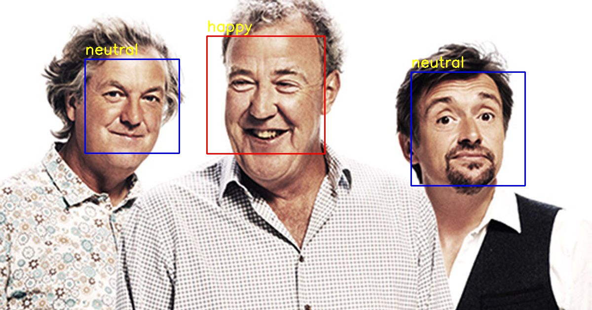
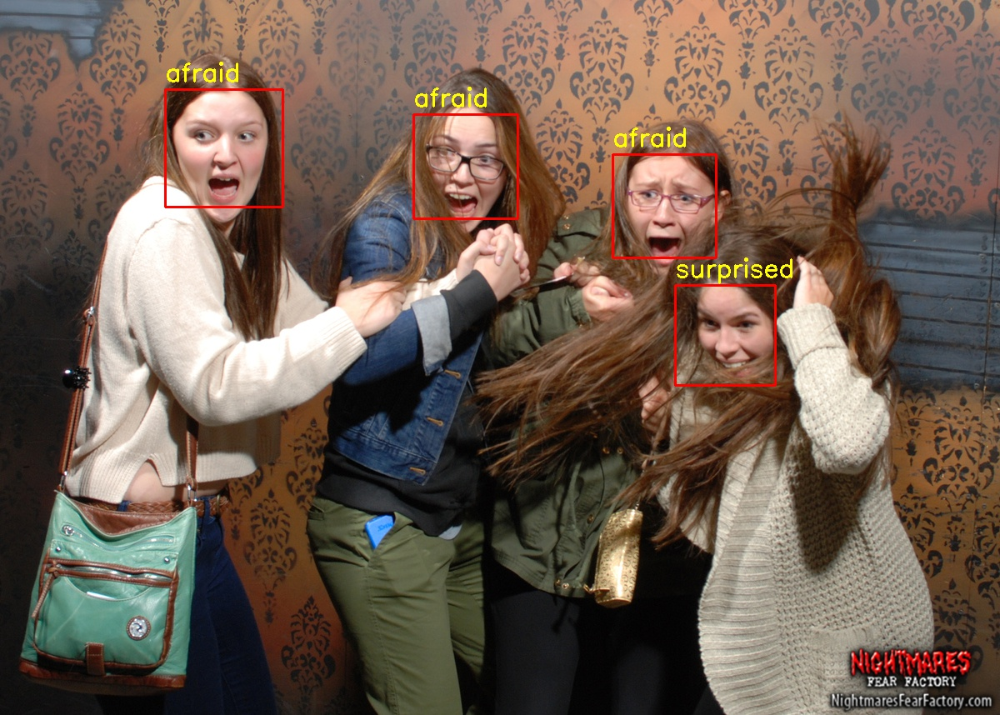

# Facifier

An emotion and gender detector based on facial features built with Python and OpenCV





## Requirements

### Python3
Before running the program, install Python 3.6:
* On Linux, open terminal and type: 
  ```
  sudo apt-get update
  sudo apt-get install python3.6
  ```
* [Anaconda](https://www.continuum.io/downloads) provides Python3.6 for Windows, macOS, and Linux too.

### OpenCV
Once you have Python3.6 installed, type the following commands:
```
pip3 install opencv-python
pip3 install opencv-contrib-python
```

## Running the Program
Run the file facifier.py with the command `python facifier.py`

The program would ask you to use your webcam. Type **y for yes** and **n for no**.

### Webcam Mode
If you chose **y**, the program would continuously process the images that is recorded through your webcam.

### Static Image Mode
Otherwise, if you chose **n**, the program would ask for an image file to be processed.
Put the image you want to process, _preferably in jpg format_, to the folder `data/sample` and simply type the file name to process it.

## Data Preprocessing

Fisherface recognizer requires every training data to have the same pixel count. This raises a problem because the dataset from [KDEF](www.emotionlab.se/resources/kdef) and [IMDB](https://data.vision.ee.ethz.ch/cvl/rrothe/imdb-wiki/) does not have uniform size and thus produces error during training.

To address this problem, **emotion\_data\_prep.py** and **gender\_data\_prep.py** are created. Both of them use face detection algorithm from **face\_detection.py** to detect faces in photos. Then, the picture would be normalized to uniform size (350px x 350px) and saved in grayscale to speed up the training process.

### KDEF

```
├── data
    ├── raw_emotion
        ├── afraid
        ├── angry
        ├── disgusted
        ├── happy
        ├── neutral
        ├── sad
        ├── surprised
    ├── raw_gender
└── src
```

Before running `emotion_data_prep.py`, ensure that your file structure is as pictured above. You would need to extract the KDEF images and put them in the respective directories that resembles the appropriate emotion.

While the KDEF database has the image shot from multiple angles, I only use **one angle**, where the person is staring straight to the camera.

### IMDB-Wiki

```
├── data
    ├── raw_emotion
    ├── raw_gender
        ├── female
        ├── male
└── src
```

Before running `gender_data_prep.py`, ensure that your file structure is as pictured above. You would need to extract the IMDB-Wiki images and put them in the respective directories that resembles the appropriate gender.

You could also use images from KDEF database, just put the males in `data/raw_gender/male` and the females in `data/raw_gender/female`.

Note that you **do not** have to include **all** images from the IMDB-Wiki. A personal computer with 8GB RAM could only handle at most around 2000 photos.

## About Models

The included models are essential for the program to detect faces, emotions, and genders.

### HaarCascade

These models are provided by OpenCV and allows the program to detect human faces. After some manual and automated testings, I decided to use the first alternate version. If for some reason you want to change the way this program detect human faces, open **face\_detection.py**, search the following line:
`faceCascade = cv2.CascadeClassifier('models/haarcascade_frontalface_alt.xml')`
and change the model path to the desired one.

### Emotion Classifier

These models are created with **train\_emotion\_classifier.py**. Each model is trained with dataset from [KDEF](www.emotionlab.se/resources/kdef). There are 2 versions: normal and decent. The normal version is trained with all the data from KDEF, while the decent version is trained with modified data from KDEF.

Modified here means deleting obviously misleading emotions. For example, there were a picture labelled sad that shows the person smiling while having tears around the eyes. It is very unusual for people to smile while crying, but this one person does it. To achieve better result, the said picture is removed from dataset. Another example, a person shows no real emotion in a picture labelled angry. That particular picture is then re-labelled as neutral.

To switch versions, open **facifier.py** and search the following line:
`fisher_face_emotion.read('models/emotion_classifier_model.xml')`
and change the model path to the desired one.

### Gender Classifier

These models are created with **train\_gender\_classifier.py**. There are 3 versions: normal, KDEF, and IMDB. The normal version is trained with both KDEF and [IMDB](https://data.vision.ee.ethz.ch/cvl/rrothe/imdb-wiki/) datasets. While KDEF and IMDB is trained with just KDEF or IMDB respectively.

Due to memory limitation only a handful of photos (2000+) from IMDB is used in building the normal and IMDB version. The best result is indeed achieved using the normal version which combined both KDEF and IMDB.

To switch versions, open **facifier.py** and search the following line:
`fisher_face_gender.read('models/gender_classifier_model.xml')`
and change the model path to the desired one.

### Windows/Linux

It turns out that a model trained using Windows can only work in Windows and that also applies to Linux. A new Windows-friendly model has been added to the model directory.

For anyone using Windows, go to line 69-73 in `src/facifier.py`.
```py3
fisher_face_emotion = cv2.face.FisherFaceRecognizer_create()
fisher_face_emotion.read('models/emotion_classifier_model.xml')

fisher_face_gender = cv2.face.FisherFaceRecognizer_create()
fisher_face_gender.read('models/gender_classifier_model.xml')
```

Change them into:
```py3
fisher_face_emotion = cv2.face.FisherFaceRecognizer_create()
fisher_face_emotion.read('models/emotion_classifier_model_windows.xml')

fisher_face_gender = cv2.face.FisherFaceRecognizer_create()
fisher_face_gender.read('models/gender_classifier_model_windows.xml')
```

The application should work properly in Windows with the new models.


## FAQ

### What kind of emotions can Facifier detect?
Facifier can classify 7 basic emotions: **afraid**, **angry**, **disgusted**, **happy**, **neutral**, **sad**, and **surprised**.

### What do the colored boxes around the faces mean?
The box highlights any detected face whether from the webcam or in a static image. A **blue box** indicates that Facifier classified that person as a male and a **red box** indicates that Facifier classified that person as a female.

### Can I train a model using my own data?
Of course, to train a model for **emotion classifier**, put images of each of the 7 emotions mentioned above in `data/raw_emotion/`. For example, put the images that show happy emotion in `data/emotion/happy/`
Then, run:
```
python3 emotion_data_prep.py
python3 train_emotion-classifier.py
```

However, training model for **gender classifier** is more difficult due to lack of datasets available.
Put the images of each gender in `data/raw_gender/`. For example, put the images of females in `data/raw_gender/female`
Then, run:
```
python3 gender_data_prep.py
python3 train_gender_classifier.py
```

### Why Fisherface?

Fisherface is not the only available recognizer in OpenCV, so why specifically choose it over the others?

For starters, it is better than using Eigenface recognizer. Eigenfaces are the eigenvectors associated to the largest . It uses integer value in its prediction. This value is the corresponding eigenvalue of the eigenvector.

Meanwhile, Fisherface uses Linear Derived Analysis (LDA) to determine the vector representation. It produces float value in the prediction. This also means that the result is better compared to Eigenface.

### References
* [IEEE Paper about Eigenfaces vs Fisherfaces](https://cseweb.ucsd.edu/classes/wi14/cse152-a/fisherface-pami97.pdf)
* [Scholarpedia article about Fisherfaces](http://www.scholarpedia.org/article/Fisherfaces)